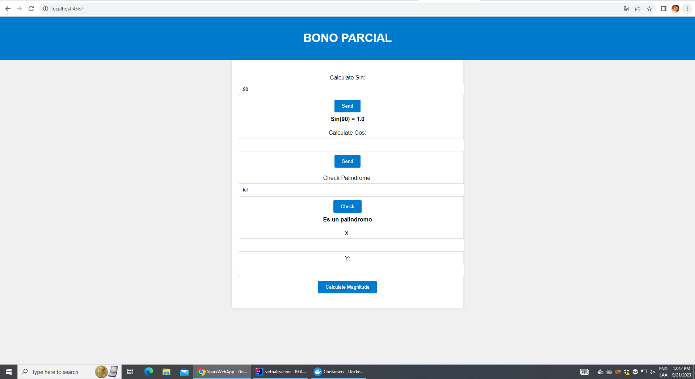
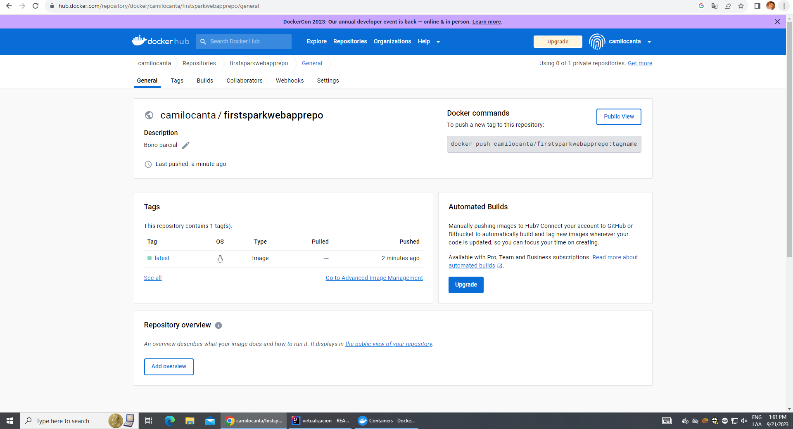

# BONO
## Para este taller los estudiantes deberán construir un servidor Web (tipo Apache) en Java. El servidor debe ser capaz de entregar páginas html e imágenes tipo PNG. Igualmente el servidor debe proveer un framework IoC para la construcción de aplicaciones web a partir de POJOS. Usando el servidor se debe construir una aplicación Web de ejemplo. El servidor debe atender múltiples solicitudes no concurrentes.

### Inicialización:
Modifique su proyecto publicando servicios REST para calcular:

- Sin

- Cos

- Determinar si una cadena es un palíndromo

- Retorna la maginitud de un vector real de dos dimensiones, es decir recibe dos parámetros reales.
### Prerequisitos:
Cosas que necesitas instalar y cómo hacerlo.

- Java Development Kit (JDK)
- Maven
- Git
- Docker

### Instalando el proyecto:

1. Para tener una copia en local del repositorio debemos abrir la termial y estar ubicado en la carpeta que queremos clonar el repositorio, seguido a esto utilizamos el comando:

```
https://github.com/CamiloCanta/BonoAREP.git
```

2. Preferencialmente, solemos abrir el proyecto en una IDE, por lo cual abriremos el proyecto en esta misma, abriremos la terminal y ejecutamos el codigo:
```
mvn clean install
```

3. Corremos la mainClass que se encentra en la ruta edu/eci/escuelaing y la clase se llama SparkWebServer

4. Ya ejecutada la aplicación, procedemos a abrir el navegador de nuestra preferencia y usamos la siguiente URL:

```
http://localhost:4567
```
4. Vista de la página




### Documentación:
Con el siguiente comando veremos la documentación:
```
mvn javadoc:javadoc
```

### Dockerhub
```
https://hub.docker.com/repository/docker/camilocanta/firstsparkwebapprepo/general
```



```
docker run -d -p 34005:6000 --name camilobono camilocanta/firstsparkwebapprepo:latest
```

### Contrucción:
- Java
- Maven
- Git

### Autor:
Camilo Andres Cantillo Tatis